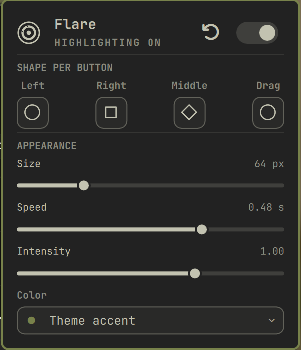

# Flare for Omarchy

Draw an animated highlight wherever you click, so an audience can see *when*
and *where* the pointer went during a demo, screen share, or recording. Lives
in the Omarchy bar, draws over everything on every display, and never
intercepts a click.



## Features

- Highlights every press across every app, the desktop, fullscreen windows,
  and all displays — the overlay is click-through, so your clicks land
  normally and nothing is intercepted
- A different outline per button, so they read apart at a glance: left, right,
  middle, and the drag trail each pick from circle, square, diamond, triangle,
  star, or off
- Secondary clicks add a `+` crosshair, middle clicks turn it 45° into an `×`
  — shape and motion carry the difference, not colour alone
- Drag leaves an evenly spaced trail, spaced by distance so it looks the same
  however fast you drag
- Size, speed, and intensity sliders; colour follows the theme accent or picks
  from eight fixed tints
- Right-click the bar widget to toggle highlighting without opening anything

## Install

```bash
omarchy plugin add https://github.com/melonamin/omarchy-flare.git --enable
```

That is the whole install. The shell picks the plugin up without a restart and
puts the widget on your bar.

To remove:

```bash
omarchy plugin remove melonamin.flare
hyprctl reload      # drops the mouse binds
```

Nothing is written outside `~/.config/omarchy`. Flare needs mouse binds inside
Hyprland to see clicks it does not have focus for, but rather than have you
paste a `require` into `hyprland.lua`, the plugin loads its own Lua through
`hyprctl eval` when the shell starts and again whenever Hyprland reloads.
Remove the plugin and your compositor config is untouched.

## Presentation mode

`SUPER + ALT + P` (also in the `SUPER + K` cheatsheet) puts a surface over
the screen that swallows every click. Clicks still highlight, but nothing
underneath reacts -- point at things without opening them. A badge across the
top says how to get out; `Esc` or the same shortcut ends it.

Rebind or disable it with the `shortcut` setting; an empty string registers
nothing. Hyprland silently refuses a keybind another bind already owns, so
`omarchy-shell flare status` reports `shortcutRegistered` and the shell logs a
warning when a chosen key collides. `SUPER+SHIFT` is nearly full in a stock
Omarchy -- `SUPER+SHIFT+P` is Google Photos -- which is why the default sits
on `SUPER+ALT`.

Presentation mode turns highlighting on for as long as it lasts, whatever the
master switch says -- a mode that swallows every click while drawing nothing
would be worse than useless. Your saved setting is not rewritten; it just takes
effect again when you exit.

While presenting, *everything* is swallowed -- including the bar and Flare's
own widget -- so `Esc` is the way back.

## Screen sharing

**Share the whole screen, not a window or a browser tab.**

| What you share | Capture path | Flare visible |
|---|---|---|
| Entire screen | `zwlr_screencopy` over the composited output | yes |
| A single window | `hyprland_toplevel_export`, that window's own buffer | no |
| A browser tab | the browser renders it; the compositor is never involved | no |

Flare draws on its own layer-shell surface, and only a full-output capture
composites that in. One Wayland client cannot draw into another's buffer, so a
window share can only ever contain that window — Meet, Zoom, Discord, and OBS
window-capture all behave this way.

Screenshots differ: `omarchy-capture-screenshot windows` grabs a *region of the
output*, so Flare does appear there.

## Settings

Click the bar widget to open the panel; the header carries the master switch
and a reset button. Everything writes to this plugin's entry in
`~/.config/omarchy/shell.json`, which you can also edit by hand or with
`omarchy bar set` — it hot-reloads on save.

| Key | Values | Default |
|---|---|---|
| `enabled` | `true`, `false` | `true` |
| `primary` | `none`, `circle`, `square`, `diamond`, `triangle`, `star` | `circle` |
| `secondary` | as above | `square` |
| `middle` | as above | `diamond` |
| `drag` | as above | `circle` |
| `releases` | quieter contracting echo on button-up; not in the panel | `false` |
| `size` | 32–160, peak ring diameter in px | `64` |
| `speed` | 0.16–1.20, pulse lifetime in seconds | `0.48` |
| `intensity` | 0.20–1.40; the soft glow appears at 0.70 and above | `1.0` |
| `shortcut` | keybind for presentation mode; `""` disables | `SUPER + ALT + P` |
| `tint` | `auto`, `blue`, `purple`, `pink`, `red`, `orange`, `yellow`, `green`, `graphite` | `auto` |

Setting a button to `none` switches it off; there is no separate enable flag
per interaction. All the presets and pulse geometry live in `FlareModel.js`.

## IPC

```bash
omarchy-shell flare status     # JSON: enabled, appearance, live counts, transport tallies
omarchy-shell flare toggle     # master switch
omarchy-shell flare pulse primary-press 1280 720   # draw one, for testing
```

## How it works

Wayland gives no client a way to observe input it does not have focus for, so
the compositor does the observing:

```
click ──▶ non-consuming Hyprland mouse bind   (hypr/flare.lua)
             │  reads hl.get_cursor_pos() in-process
             ▼
          $XDG_RUNTIME_DIR/flare.fifo   (fallback: omarchy-shell flare pulse)
             ▼
          Service.qml ──▶ one click-through overlay per display
```

The binds are **non-consuming**: Hyprland runs the dispatcher *and* delivers
the click to the window under the pointer, so highlighting never costs you a
click. No elevated permissions, no `input` group, no reading `/dev/input`.

Events travel over a FIFO because shelling out per event costs ~19 ms, against
~0.02 ms for a FIFO write — affordable for a click, not for a 30 Hz drag trail.
A FIFO write blocks once its buffer fills and the binds run on the compositor's
thread, so the plugin stamps a counter from its own event loop and the Lua side
abandons the FIFO after 200 unacknowledged writes (~5 KB against a 64 KB
buffer), falling back to shelling out.

## Notes

- Pointer-locked clients (games, some remote-desktop apps) grab the pointer, so
  binds may not fire there.
- Hyprland's Lua timers cannot be stopped once created, so the drag trail is a
  chain of one-shots retired by a generation counter.
- The overlay stays mapped while the plugin is loaded. Mapping it only while a
  pulse is alive reports success but never creates the layer surface.

## Tests

```bash
node --test tests/model.test.js   # unit: presets, geometry, settings parsing
tests/integration.sh              # live: binds, FIFO delivery, pulses drawn
```

## License

MIT
